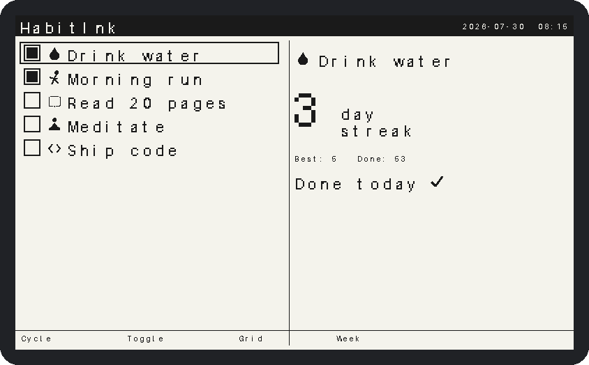
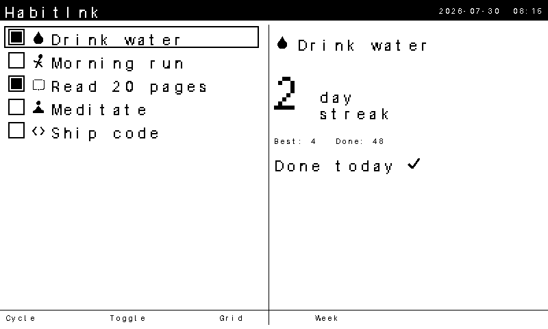
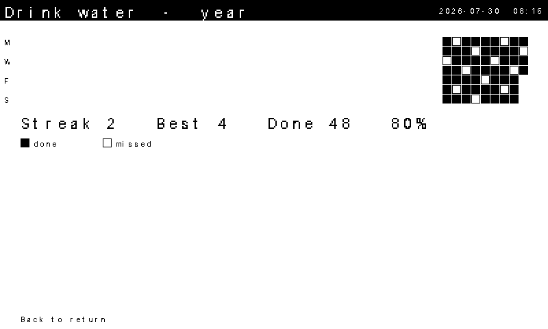
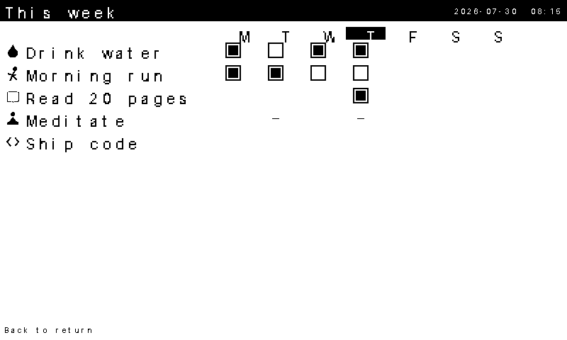
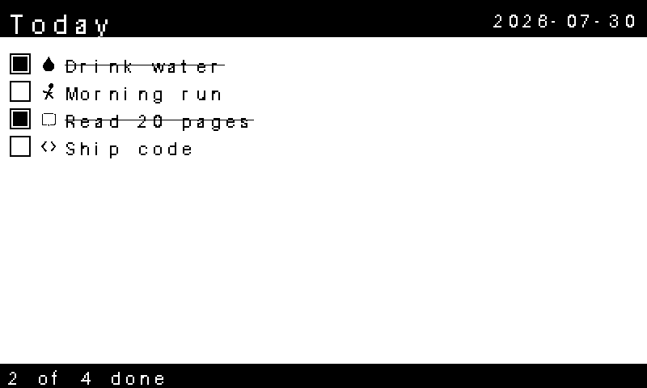
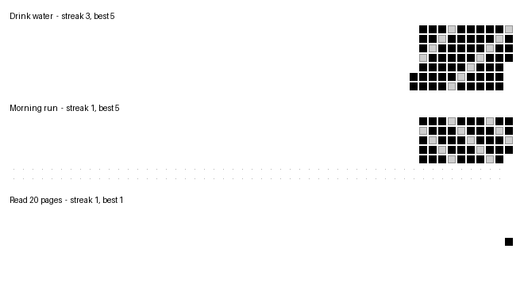

<div align="center">


### habits that literally stare back at you from the desk

_A habit and streak tracker for the Xteink X4/X3 pocket e-reader that treats "always-on e-ink" as a superpower, not a gimmick._

[](https://github.com/mohitagw15856/habitink/actions/workflows/ci.yml)
[](LICENSE)
[](platformio.ini)
[](https://platformio.org/)




</div>

---

## The pitch

Your e-reader spends 99% of its life asleep doing nothing. HabitInk hijacks that
dead time: the standby screen becomes today's habit checklist, so the unfinished
ones sit on your desk quietly judging you. Pick it up, one press to select, one
press to tick it off, and it is back asleep in under ten seconds. No apps, no
notifications, no doomscrolling. Just ink and guilt. ✨

HabitInk is a **standalone firmware**, not a reader mod. It shares the
architecture and hardware SDK of the excellent
[CrossPoint Reader](https://github.com/crosspoint-reader/crosspoint-reader)
ecosystem but carries none of its reader code, which is exactly what keeps it
tiny and sips the battery. The full reasoning lives in
[docs/ARCHITECTURE.md](docs/ARCHITECTURE.md).

## What it does

- 🔘 **One-press logging.** Cycle habits with one button, toggle today with
  another. That is the whole ritual.
- 🟩 **Streak grids.** A GitHub-contributions-style year grid per habit, drawn
  crisply for 1-bit e-ink.
- 🗓️ **Weekly overview.** Every habit, every day of the week, at a glance.
- 😴 **A sleep face that nags.** Standby is your checklist, completed items
  struck through, an "N of M done" tally at the bottom.
- 🪶 **Featherweight state.** Habits and an append-only log live on the SD card;
  only a few bytes stay in RAM between presses.
- 🐍 **A companion CLI.** Monthly reports, shareable streak images, and backfill
  for the days you forgot.
- 🔋 **Wake, log, sleep in under ten seconds.** The whole point.

## Screenshots

Rendered straight from the actual firmware renderer at the panel's 800x480.

| Home | Year grid |
| :---: | :---: |
|  |  |
| **Weekly view** | **Sleep face** |
|  |  |

...and the companion turns your logs into a shareable grid:

<div align="center">

</div>

_Photos of the firmware on real hardware will land here once the device build is
verified on a physical X4/X3 (see [docs/HARDWARE_TESTING.md](docs/HARDWARE_TESTING.md))._

## How it works in five seconds

```
sleep  →  press to wake  →  Down cycles habits  →  Confirm ticks today
   ↑                                                        │
   └──────────  idle / power press  ←  back to standby  ←────┘
```

Everything else (a per-habit year grid on Right, the weekly view on Left) is one
press away and one press back.

## Compatibility

Works with **CrossPoint v1.5.0**-class devices: HabitInk targets the same Xteink
X4/X3 hardware, with its device layer supplied by
[inkkit](https://github.com/mohitagw15856/inkkit). It keeps its data in its
own `/.habitink` directory and never touches CrossPoint's `/.crosspoint`, so
they can share an SD card. They are separate firmwares, so you flash one at a
time.

## Install and flash

HabitInk builds with [PlatformIO](https://platformio.org/).

```sh
# Host build of the portable app layer (no hardware or SDK needed)
pio run -e native && .pio/build/native/program

# Device build for the Xteink X4/X3 (ESP32-C3); run one env at a time
pio run -e xteink_x4
pio run -e xteink_x4 -t upload   # flash over USB
pio device monitor               # serial log at 115200
```

The device environments (`xteink_x4`, `xteink_x3`, identical firmware with
runtime device detection) get their complete device layer from
[inkkit](https://github.com/mohitagw15856/inkkit), pinned in `platformio.ini`;
no submodules or extra SDK setup. Status: builds in CI, not yet verified on
device; [docs/HARDWARE_TESTING.md](docs/HARDWARE_TESTING.md) has the
verification checklist.

### First run

Drop a `/.habitink/habits.tsv` on the SD card (or let the companion write it):

```
# habitink habits v1
1	water	daily	Drink 2L water
2	run	1111100	Morning run
3	book	0000011	Weekend reading
```

Up to twelve habits, `daily` or a Monday-first `1111100` weekday mask, and an
icon token from the built-in set. Full spec in [docs/FORMAT.md](docs/FORMAT.md).

## Companion tool

A Python CLI reads the SD card and helps you off the device.

```sh
cd companion && pip install -e .

# Monthly Markdown report plus a PNG of every habit's year grid
habitink report --sd /path/to/sdcard --month 2026-07 --out report.md --png grid.png

# Backfill a day you forgot (append-only, just like the device)
habitink edit --sd /path/to/sdcard --habit "Morning run" --date 2026-07-28 --done
```

More in [companion/README.md](companion/README.md).

## Build and test

Almost all of the firmware is portable C++ that runs on your laptop, so the
tests are fast and need no hardware.

```sh
# Native C++ unit tests (core logic, renderer, firmware controller): 53 tests
cmake -S test -B build/test -G Ninja -DCMAKE_BUILD_TYPE=Release
cmake --build build/test && ctest --test-dir build/test --output-on-failure

# Companion tests: 40 tests
cd companion && pip install -e ".[test]" && pytest
```

The embedded font and icons are generated and checked in; regenerate with
`python3 scripts/gen_font.py` and `python3 scripts/gen_icons.py`. The
screenshots and demo GIF come from `scripts/render_preview.cpp`,
`scripts/render_frames.cpp` and `scripts/make_gifs.py`.

## Repository layout

```
lib/HabitCore    portable habit logic (dates, config, log, streaks, grids)
lib/HabitUI      portable 1-bit renderer, embedded assets, screens and flow
src/             firmware: controller + inkkit device adapters + Arduino entry
companion/       Python CLI (report, edit) with pytest
test/            native C++ tests
docs/            architecture, data format, hardware testing checklist
scripts/         asset generators and the screen preview renderer
```

## Documentation

- [docs/ARCHITECTURE.md](docs/ARCHITECTURE.md) - design and the fork vs module vs standalone decision
- [docs/FORMAT.md](docs/FORMAT.md) - the on-disk data format
- [docs/HARDWARE_TESTING.md](docs/HARDWARE_TESTING.md) - on-device verification checklist
- [CONTRIBUTING.md](CONTRIBUTING.md) - how to contribute

## Licence

MIT, see [LICENSE](LICENSE). HabitInk reuses the CrossPoint / FreeInk
ecosystem's ideas and MIT-licensed conventions (via the inkkit device layer)
but contains no copied CrossPoint source. The embedded font is generated from Pillow's permissively licensed
built-in bitmap font.

<div align="center">
<sub>Made with ink, restraint, and a healthy fear of broken streaks.</sub>
</div>
